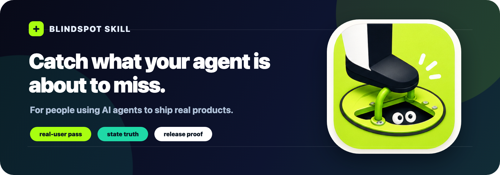
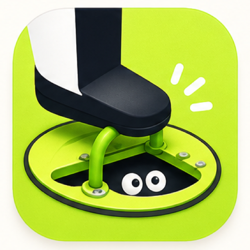

<p align="center">
  
</p>

<p align="center">
  <a href="README.md"></a>
  <a href="README.zh-CN.md"></a>
</p>

# Blindspot Skill

<p align="center">
  <em>让 AI Coding Agent 在写代码前，先看见自己将要漏掉的盲点。</em>
</p>

<p align="center">
  
</p>

Blindspot Skill 是一个给 Codex / Claude Code 这类 AI Coding Agent 使用的「写代码前预检查」skill。

它的目标很简单：**在 Agent 动手写代码前，先让它像真实用户一样走一遍产品，把它马上要漏掉的问题提前暴露出来。**

你有没有遇到过这种情况：

Agent 写完代码，能跑，UI 也像是改好了，但你一真机测试，就发现它又漏了一个入口、误判了一个状态、写了一句用户根本看不懂的文案，或者把“返回了”当成“成功了”。

**Blindspot Skill 就是为了解决这个问题。**

它不是凭空写出来的。它来自两个真实大型项目中，与 Codex、Claude Code 等工具的 **481 组本地对话 / 任务记录**。我作为项目实施者，在反复真机测试、代码审查、App Review 返工和上线部署中，给 Agent 留下了 **1,132 条纠错、追问、返工和方案审查类交互线索**。

我把这些线索按高信号链路逐条复盘，不只记录“哪里错了”，而是反推 Agent 当时默认相信了什么、为什么这个假设在真实产品里失效，最终沉淀成 **69 条可追溯的典型盲点**。

这些问题不是编译报错，而是 Codex、Claude Code 等工具在真实产品开发中最容易犯、也最难自己发现的产品错误：权限状态说谎、旧逻辑没清干净、AI 记忆泄漏、UI 文案技术正确但用户不懂、OTA 修不了 native 问题、一个入口改了另一个入口还坏着。

用它的目的很简单：**在 Agent 写代码前，让它先想一遍真实用户会怎么把这个功能用坏。**

这个 skill 不是给 Agent 多写一份冗长 PRD，也不是让你变成专业程序员。它更像一个写代码前的盲点检查器：当你只有一个模糊想法、一个截图、一个 bug、一个竞品参考，或者只是觉得“这里不太对”时，它会逼 Agent 先把真实用户、产品状态、数据来源、旧逻辑回归、AI 上下文、视觉状态、外部集成和发布路径都想一遍。

来源审计记录在这里：[docs/origin-audit.md](docs/origin-audit.md)。逐条纠错证据表在这里：[docs/correction-ledger.md](docs/correction-ledger.md)。

## 适合谁用

Blindspot Skill 最适合正在用 AI Agent 做真实产品的人。

你不需要是专业程序员，也不需要是资深产品经理。它主要帮助这些人：

- 想用 Codex、Claude Code 或其他 Coding Agent 做产品的独立开发者、创业者、设计师、运营、内容创作者和行业专家
- 不太懂代码，但希望 Agent 在写代码前先把需求、用户状态和边界情况问清楚的人
- 想把一个模糊产品想法变成可执行开发说明的人
- 想快速检查用户流程、成功状态、文案、权限、支付、AI 输出和发布风险的产品经理
- 想让 Agent 不要一上来就写代码，而是先把产品盲点想清楚的工程师

如果你经常这样和 Agent 说话：

- “帮我做一个类似这个截图的功能”
- “这个页面感觉不太清楚，你帮我优化一下”
- “这个 bug 帮我修掉”
- “帮我接一个支付 / 权限 / AI 总结 / 上传 / 登录流程”
- “我不知道怎么描述需求，你先帮我想清楚”

那这个 skill 就是为你准备的。

它不替代你的判断。它的作用是帮你和 Agent 一起发现那些“你还没说清楚、Agent 也很可能没想到”的地方。

## 这些真实纠错暴露了什么

| 真实纠错暴露的问题 | Agent 的盲点 |
| --- | --- |
| UI 显示 connected / saved / enabled，但系统其实没有证据证明成功 | 虚假的成功状态 |
| 外部系统没有数据，被误判成没有授权或同步失败 | no data、denied、unknown 混在一起 |
| 一个入口修好了，但 onboarding、settings、弹窗、详情页还走旧逻辑 | 多入口逻辑漂移 |
| 最终页面是对的，但中间会闪一下旧状态或错误状态 | 只看最终态，不看过渡态 |
| 用 live update 想修 native、后端、配置或审核包里的问题 | 发布层级判断错误 |
| AI 关闭了某个设置后，仍然从旧 memory、summary、prompt example 里说旧事实 | AI 上下文泄漏 |
| 把 prompt 里的软提醒当成硬性 guardrail | 软约束误当硬约束 |
| 本来应该有结构化卡片或视觉输出，最后退化成普通文字 | 结构化输出遗漏 |
| 文案技术上正确，但真实用户看不懂、不会选 | 真实用户语言盲点 |
| 只改了读路径，漏了写路径、缓存、派生字段、其他展示面 | 只修局部，漏全链路 |

这个 skill 最核心的动作是：当用户让 Agent “再改一下”“这里还是不对”“为什么又这样”时，不把它当成一个孤立新需求，而是把它当成证据。它会反推上一轮 Agent 默认相信了什么、真实用户实际看到了什么、哪条通用规则本来可以提前拦住这个问题。

这些问题背后的模式非常稳定：AI Agent 写代码很快，但它经常看不见代码之外的产品现实。它会漏入口、信本地 flag、把没有数据当成失败、把 prompt 文案当成硬约束、写出只有工程师看得懂的 UI 文案、修了眼前这个页面却漏掉用户真正会用到的版本。

Blindspot Skill 就是把这些错误变成一套固定的写代码前检查。目标是在用户、审核人员、同事发现问题前，先让 Agent 自己发现。

## 为什么它有用

很多 AI 写代码失败，不是失败在语法。

它们失败在写代码前没有问：

- 什么证据能证明这个成功状态是真的？
- 第一次使用产品的人看到这句文案，会相信发生了什么？
- 还有哪些按钮、页面、弹窗、后台任务、设置项也会进入同一个逻辑？
- 旧请求、缓存、AI 记忆、后台任务会不会覆盖用户刚刚做的新操作？
- 这个 prompt 规则是真的硬性约束，还是只是模型可能遵守的建议？
- 真实用户和审核人员拿到的是不是同一个前端、后端、native build 和配置版本？

Blindspot Skill 会让 Agent 在写代码前先把这些问题想清楚。

## 快速示例

用户：

```md
把这个权限流程做得简单一点。
```

不用 Blindspot Skill 时：

```md
Agent 可能直接改文案和 UI。
```

使用 Blindspot Skill 时：

```md
Agent 会先检查：

1. 什么能证明权限真的打开了？
2. 平台返回 App 但结果未知时，UI 应该怎么说？
3. onboarding、settings、重新连接按钮是不是走同一套逻辑？
4. 这个改动能 live update，还是必须打 native build？
5. 一个没耐心的真实用户，只看标题和按钮，能不能马上知道下一步？
```

区别在这里：第二种不是只让 UI 更干净，而是避免 UI 更干净地欺骗用户。

## 它会抓哪些盲点

| 盲点 | 避免的问题 |
| --- | --- |
| 虚假成功状态 | UI 在没有证据时就说 saved、connected、synced、paid |
| 临时结果和正式结果 | 用户只是预览或编辑一半，数据却已经生效 |
| 多入口漂移 | 类似按钮在不同页面做的事情不一样 |
| 同一数据多处展示 | 首页、详情页、导出、通知、AI 总结里的数据不一致 |
| 外部系统 no-data 歧义 | 空数据被误判成拒绝权限或同步失败 |
| 旧状态覆盖新操作 | 慢请求、缓存、后台任务、webhook 覆盖用户最新操作 |
| 权限拒绝 | 用户拒绝一个权限后，整个产品被不必要地卡住 |
| AI 上下文泄漏 | 旧 memory、summary、prompt example、tool result 泄漏过期事实 |
| 软 guardrail | prompt-only 规则被误当成确定性校验 |
| 视觉回归 | 类型检查通过，但小屏、平板、长文案、大字体把 UI 挤坏 |
| 真实用户语言盲点 | 内部公式、技术词、抽象表达直接暴露给用户 |
| 发布路径错配 | 用户、审核、前端、后端、native build、配置看到的不是同一版 |

## 安装

### Codex

把 skill 目录复制到 Codex skills 目录：

```bash
mkdir -p ~/.codex/skills
cp -R skills/codex/blindspot ~/.codex/skills/blindspot
```

如果 skill 列表没有立刻刷新，重启 Codex 或打开一个新会话。

### Claude Code

把 skill 目录复制到 Claude skills 目录：

```bash
mkdir -p ~/.claude/skills
cp -R skills/claude/blindspot ~/.claude/skills/blindspot
```

也可以导入打包文件：

```text
packages/blindspot.skill
```

## 使用方法

```md
用 agent-blindspot 先帮我澄清需求，不要直接写代码。

我的需求是：帮我做一个客户导入功能。
```

这个 skill 会输出：

- blindspot read
- 可能方向
- 真实用户 walkthrough
- 成功状态的 source-of-truth audit
- 旧行为回归合同
- 涉及 AI 时的 AI context audit
- 发布证据要求
- 最多 3 个关键问题
- 用户确认后，输出可以交给 coding agent 执行的开发说明

## 示例

可以看这些文件：

- [客户导入](examples/customer-import.md)
- [订阅付费墙](examples/subscription-paywall.md)
- [日历事件](examples/calendar-event.md)
- [管理后台看板](examples/admin-dashboard.md)
- [AI 总结功能](examples/ai-summary-feature.md)

每个示例都包含：

1. 原始模糊需求
2. Skill 会问的问题
3. 开发需求说明大纲

## 评估方式

这个 skill 不是用来评估代码写得好不好，而是评估 AI 在写代码前有没有看见自己容易漏掉的问题。

一个好的输出应该：

- 每次最多问 3 个问题
- 产品规则没清楚前，不直接问数据库、API、字段
- 缩小范围时，写清楚这次不做什么
- 解释现在不做可能带来什么问题
- 抓住隐藏的状态、数据、上下文、失败、权限、AI、视觉或发布问题
- 没有证据的成功状态要降级，不允许直接说成功
- 高风险请求要有负向验收
- 用户确认后，能输出可以交给 coding agent 执行的开发说明

评估样例见：[evals/prompts.json](evals/prompts.json)

## 项目结构

```text
blindspot-skill/
  README.md
  README.zh-CN.md
  assets/
  skills/
    codex/blindspot/SKILL.md
    claude/blindspot/SKILL.md
  packages/
    blindspot.skill
  docs/
    origin-audit.md
    correction-ledger.md
    patterns.md
  examples/
  evals/
```

## License

MIT
