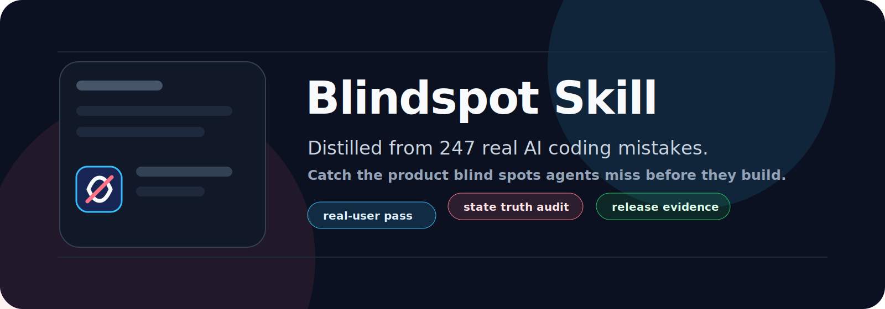
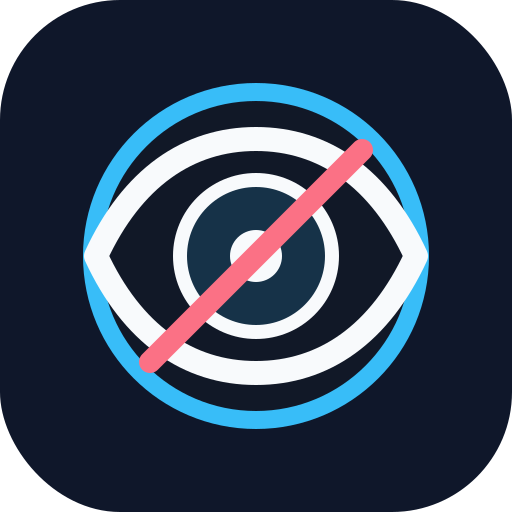

<p align="center">
  
</p>

# Blindspot Skill

<p align="center">
  <em>让 AI Coding Agent 在写代码前，先看见自己将要漏掉的盲点。</em>
</p>

<p align="center">
  
</p>

[English README](README.md)

Blindspot Skill，原名 **ReqCheck**，是一个给 Codex / Claude Code 这类 AI Coding Agent 使用的预检查 skill。它会让 Agent 在写代码前，先像真实人类用户一样走一遍产品，再检查产品状态、真实证据、旧逻辑回归、AI 上下文、视觉状态、外部集成和发布路径里可能漏掉的问题。

它不是普通的需求清单。它是从 **20+ 次真实 Codex / Claude Code 产品开发纠错循环**里总结出来的。在这些真实对话中，Agent 往往能写出看起来合理的方案和能运行的代码，但仍然需要人类用户指出：真实用户会误解、状态会撒谎、旧入口没改、发布路径不对、AI 记忆会泄漏旧信息。

## 这些真实纠错暴露了什么

| 人类反复纠正的问题 | Agent 的盲点 |
| --- | --- |
| UI 显示 connected / saved / enabled，但系统其实没有证据证明成功 | 虚假的成功状态 |
| 外部系统没有数据，被误判成没有授权或同步失败 | no data、denied、unknown 混在一起 |
| 一个入口修好了，但 onboarding、settings、弹窗、详情页还走旧逻辑 | 多入口逻辑漂移 |
| 最终页面是对的，但中间会闪一下旧状态或错误状态 | 只看最终态，不看过渡态 |
| 用 live update 想修 native、后端、配置或审核包里的问题 | 发布层级判断错误 |
| AI 关闭了某个设置后，仍然从旧 memory、summary、prompt example 里说旧事实 | AI 上下文泄漏 |
| 把 prompt 里的软提醒当成硬性 guardrail | 软约束误当硬约束 |
| 本来应该有结构化卡片或视觉输出，最后退化成普通文字 | 结构化输出遗漏 |
| 文案技术上正确，但真实用户看不懂、不会选 | 真实用户语言盲点 |
| 只改了读路径，漏了写路径、缓存、派生字段、其他展示面 | 只修局部，漏全链路 |

Blindspot Skill 的作用，就是把这些人类纠错沉淀成 Agent 写代码前的固定检查动作。

## 为什么需要它

很多 AI 写代码失败，不是失败在语法。

它们失败在写代码前没有问：

- 什么证据能证明这个成功状态是真的？
- 第一次使用产品的人看到这句文案，会相信发生了什么？
- 还有哪些按钮、页面、弹窗、后台任务、设置项也会进入同一个逻辑？
- 旧请求、缓存、AI 记忆、后台任务会不会覆盖用户刚刚做的新操作？
- 这个 prompt 规则是真的硬性约束，还是只是模型可能遵守的建议？
- 真实用户和审核人员拿到的是不是同一个前端、后端、native build 和配置版本？

Blindspot Skill 会让 Agent 在写代码前先把这些问题想清楚。

## 快速示例

用户：

```md
把这个权限流程做得简单一点。
```

不用 Blindspot Skill 时：

```md
Agent 可能直接改文案和 UI。
```

使用 Blindspot Skill 时：

```md
Agent 会先检查：

1. 什么能证明权限真的打开了？
2. 平台返回 App 但结果未知时，UI 应该怎么说？
3. onboarding、settings、重新连接按钮是不是走同一套逻辑？
4. 这个改动能 live update，还是必须打 native build？
5. 一个没耐心的真实用户，只看标题和按钮，能不能马上知道下一步？
```

区别在这里：第二种不是只让 UI 更干净，而是避免 UI 更干净地欺骗用户。

## 它会抓哪些盲点

| 盲点 | 避免的问题 |
| --- | --- |
| 虚假成功状态 | UI 在没有证据时就说 saved、connected、synced、paid |
| 临时结果和正式结果 | 用户只是预览或编辑一半，数据却已经生效 |
| 多入口漂移 | 类似按钮在不同页面做的事情不一样 |
| 同一数据多处展示 | 首页、详情页、导出、通知、AI 总结里的数据不一致 |
| 外部系统 no-data 歧义 | 空数据被误判成拒绝权限或同步失败 |
| 旧状态覆盖新操作 | 慢请求、缓存、后台任务、webhook 覆盖用户最新操作 |
| 权限拒绝 | 用户拒绝一个权限后，整个产品被不必要地卡住 |
| AI 上下文泄漏 | 旧 memory、summary、prompt example、tool result 泄漏过期事实 |
| 软 guardrail | prompt-only 规则被误当成确定性校验 |
| 视觉回归 | 类型检查通过，但小屏、平板、长文案、大字体把 UI 挤坏 |
| 真实用户语言盲点 | 内部公式、技术词、抽象表达直接暴露给用户 |
| 发布路径错配 | 用户、审核、前端、后端、native build、配置看到的不是同一版 |

## 安装

### Codex

把 skill 目录复制到 Codex skills 目录：

```bash
mkdir -p ~/.codex/skills
cp -R skills/codex/reqcheck ~/.codex/skills/reqcheck
```

如果 skill 列表没有立刻刷新，重启 Codex 或打开一个新会话。

### Claude Code

把 skill 目录复制到 Claude skills 目录：

```bash
mkdir -p ~/.claude/skills
cp -R skills/claude/reqcheck ~/.claude/skills/reqcheck
```

也可以导入打包文件：

```text
packages/reqcheck.skill
```

## 使用方法

```md
用 reqcheck 先帮我澄清需求，不要直接写代码。

我的需求是：帮我做一个客户导入功能。
```

这个 skill 会输出：

- blindspot read
- 可能方向
- 真实用户 walkthrough
- 成功状态的 source-of-truth audit
- 旧行为回归合同
- 涉及 AI 时的 AI context audit
- 发布证据要求
- 最多 3 个关键问题
- 用户确认后，输出可以交给 coding agent 执行的开发说明

## 示例

可以看这些文件：

- [客户导入](examples/customer-import.md)
- [订阅付费墙](examples/subscription-paywall.md)
- [日历事件](examples/calendar-event.md)
- [管理后台看板](examples/admin-dashboard.md)
- [AI 总结功能](examples/ai-summary-feature.md)

每个示例都包含：

1. 原始模糊需求
2. Skill 会问的问题
3. 开发需求说明大纲

## 评估方式

这个 skill 不是用来评估代码写得好不好，而是评估 AI 在写代码前有没有看见自己容易漏掉的问题。

一个好的输出应该：

- 每次最多问 3 个问题
- 产品规则没清楚前，不直接问数据库、API、字段
- 缩小范围时，写清楚这次不做什么
- 解释现在不做可能带来什么问题
- 抓住隐藏的状态、数据、上下文、失败、权限、AI、视觉或发布问题
- 没有证据的成功状态要降级，不允许直接说成功
- 高风险请求要有负向验收
- 用户确认后，能输出可以交给 coding agent 执行的开发说明

评估样例见：[evals/prompts.json](evals/prompts.json)

## 项目结构

```text
reqcheck/
  README.md
  README.zh-CN.md
  assets/
  skills/
    codex/reqcheck/SKILL.md
    claude/reqcheck/SKILL.md
  packages/
    reqcheck.skill
  docs/
    patterns.md
  examples/
  evals/
```

## License

MIT
